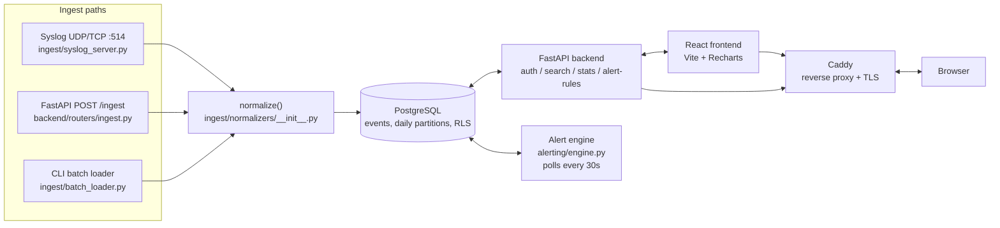

# Architecture

See `docs/DECISIONS.md` for the full rationale behind every choice referenced here —
this document is an overview synthesized from that log, not a replacement for it.

## Data flow

All three ingest paths call the same `normalize()` function, but they don't share a
trust boundary: the syslog listener and `POST /ingest` are network-facing and get
their tenant from the JWT/process config, never from the message itself, while the
CLI batch loader is an operator-run local tool reading local files, so a per-record
`tenant` field in the input is honored there. See the "Ingest trust boundary" row
below and `docs/DECISIONS.md` #23.

## Tenant model — the JWT claim is the sole source of truth

Every tenant-scoped operation in this system gets its tenant value from exactly one
place: the `tenant` claim of a server-issued, server-verified JWT
(`backend/security.py`'s `TokenClaims`, `{sub, role, tenant}`). No endpoint accepts
`tenant` from a request body, query parameter, or header — where sample payloads
include a `tenant` field (e.g. the `/ingest` body), the backend explicitly discards
it and substitutes `claims.tenant` before normalization
(`backend/routers/ingest.py`, `docs/DECISIONS.md` #23). Claims are established once
per HTTP request by `backend/deps.py`'s `get_current_claims` and never trusted from
anywhere else.

This single-source-of-truth model only holds if forging a claim is infeasible:
`backend/config.py`'s `validate_jwt_secret` runs at import time and refuses to start
the backend if `JWT_SECRET_KEY` is unset or still equal to the shipped placeholder
(`changeme-generate-a-real-secret`) — a guessable secret would let anyone mint a
validly-signed JWT for any tenant, silently defeating every RLS policy below
(`docs/DECISIONS.md` #28).

## Tenant isolation, layer by layer

| Layer | Mechanism | DECISIONS ref |
|---|---|---|
| Postgres connection role | The backend connects as `app_user`, a non-superuser, non-owner role (`backend/db/init/01_roles.sh`). The schema owner (`POSTGRES_USER`) is a superuser and would bypass RLS entirely regardless of `FORCE` if the backend ever connected as it — the real protection is that it never does. | #6 |
| Row-level policy | `CREATE POLICY tenant_isolation ON events USING (tenant = current_setting('app.tenant', true)) WITH CHECK (...)`, plus a `CHECK (tenant <> '')` column constraint. This fails closed: an unset `app.tenant` (`current_setting` returns `NULL`) or a reset one (Postgres resets a local GUC to `''`, not `NULL`, once its transaction ends) both match zero rows rather than all rows. | #7, #19, #20 |
| Partition inheritance | RLS does not propagate from a partitioned parent to its partitions (Postgres behavior, confirmed empirically). `apply_tenant_rls(partition_name)` in `backend/db/init/02_schema.sql` re-applies `ENABLE`+`FORCE` RLS and the policy per partition, idempotently, and is invoked both for the default partition and from `create_daily_partitions()` (`backend/db/init/03_partition_maintenance.sql`) so every new daily partition inherits isolation automatically. | #8 |
| Transaction-scoped context | `set_config('app.tenant', <value>, true)` is transaction-local (the third argument, `true`, means "local") and is always the first statement inside the same transaction as the query it protects — at exactly three call sites: `backend/db.py`'s `get_tenant_conn` (per HTTP request), `ingest/db.py`'s `write_event_sync`/`write_event_async` (ingest writes), and `alerting/engine.py`'s `evaluate_tenant()` (once per tenant per poll tick). | #18, #30 |
| Ingest trust boundary | `POST /ingest` takes tenant only from `claims.tenant`, discarding any client-supplied `tenant` field in the body. Syslog ingest fixes tenant per-process via `--tenant`/`SYSLOG_TENANT` at startup, never from the message. The CLI batch loader accepts `--tenant` or a per-record field, because it's an operator-run local tool — a different trust boundary than the two network-facing paths. | #23 |
| `users` table | Deliberately has no RLS. `POST /auth/login` receives only `{username, password}` — no tenant is known yet, so the login lookup has to find the user's tenant *from* the username before `app.tenant` can be set. RLS's fail-closed behavior would make that lookup always return zero rows if `users` had the same policy as `events`. `username` is kept globally unique (not per-tenant) so the lookup stays unambiguous. | #25 |
| Alert engine | A separate process, polling every 30s. `discover_tenants()` runs `SELECT DISTINCT tenant FROM users` (relying on `users` having no RLS, since no tenant context exists yet), then loops per tenant, calling `evaluate_tenant()` — which does its own `set_config` inside its own transaction before running detection queries for that tenant. | #40, #37, #36, #38 |
| Frontend | No tenant selector anywhere — an explicit comment in `frontend/src/components/TimeRangeFilter.jsx` states why one would contradict the rest of this architecture. Tenant is read-only, sourced from the server-verified `GET /auth/me` response via `AuthContext.jsx`, and displayed read-only in `Layout.jsx`. | #44, #42, #46 |

## Deployment modes

Three Caddy configurations exist for three deployment situations — see
`docs/setup_appliance.md` and `docs/setup_saas.md` for runnable steps:

- **Appliance/dev** (`Caddyfile`) — self-signed TLS via `tls internal`, bound to
  `localhost`/`127.0.0.1`.
- **SaaS with a domain** (`Caddyfile.saas`) — automatic HTTPS via Let's Encrypt.
- **SaaS without a domain** (`Caddyfile.saas-ip`) — plain HTTP, because TLS via SNI
  doesn't work against a bare IP target (`docs/DECISIONS.md` #55).
